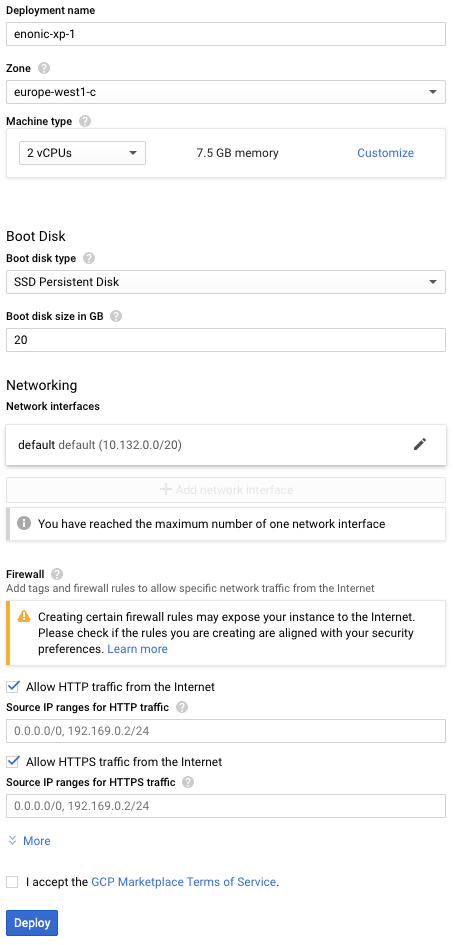

= Running Enonic XP on the Google Cloud Platform
:toc: right
:experimental:

*Everything you need to know for production grade deployment of Enonic XP using the Google Cloud Launcher image*

== Deploy Launcher image

[cols="1%s,99%a"]
[frame="none"]
[grid="none"]
|============================
|1| Visit https://cloud.google.com/[Google Cloud] and select btn:[Launcher] from the top menu.
|2| Click  btn:[Explore Launcher] and then search for Enonic XP.
|3| You should now see the image below, click btn:[Launch on Compute Engine]

image::images/launcher-image.png["Enonic XP Launcher Image", width="828px"]
|4| You should now see the image below:

You may optionally change the settings above to match your requirements.

When ready, press btn:[Deploy].
|5| You will now see a new screen as the server is starting.

[WARNING]
====
The launch process typically takes 1 to 2 minutes, all depending on the server size.
After the Google Cloud loading icons stop spinning, the image might not be ready.
XP docker containers are built in the background - during this time you might see a 503 error so please have patience.
====
|============================

== Login and Welcome Tour

When you have confirmed the server is running, it is time to login to the Admin Console.

[cols="1%s,99%a"]
[frame="none"]
[grid="none"]
|============================
|1| *Open Admin Console:* From the info panel (image below), Click btn:[Log into the Admin Panel] to access Enonic XP Admin Console

image::images/launcher-details.png["Deployment details", width="468px"]

WARNING: If you want to access admin with encryption, simply replace "http" with "https" in your browsers url, and accept using the self-signed certificate

|2| *Log in:* For security reasons, instant admin user creation has been disabled in Google Cloud.
You must sign in with username `su` and the temporary password generated by Google Cloud. (This is listed in the info panel of your instance)

image::images/xp-login.png["Deployment details", width="449px"]

|3| *Complete "Welcome Tour":* The first time you visit your installation, the Welcome Tour will be displayed.
Go through the steps, and optionally install the demo applications.

TIP: The welcome tour is only displayed for administrative users, and can be disabled using configuration options.

|============================

== Create the admin user

Using the "Super User" `su` to manage your instance is not recommended, also the temporary password will be reset every time you restart the instance.
As such we need to create an administrative user that can be used on a permanent basis

[cols="1%s,99%a"]
[frame="none"]
[grid="none"]
|============================
|1| *Open Users tool:* From the launcher panel on the right (optionally hidden behind the top right burger icon) click btn:[Users].
|2| *New User:* To create a new user simply click btn:[New] and then btn:[User] from the top menu.

|3| *Set the user name:* This is a personal user - choose your favorite user name

|4| *Set the password:* This user will have access to your entire system, make sure to use a secure password.

image::images/xp-user-password.png["Strong password", width="692px"]

TIP: The password is hashed, and never stored as plain text in XP
|5| *Add roles:* Finish off by adding roles to the user: "Administrator" and "Admin Console Login".

image::images/xp-user-roles.png["User roles", width="694px"]
When ready press btn:[Save]
|6| *Verify the user:* To make sure the user is working properly, log out from the bottom of the launcher menu, and test logging in again with your new user
|============================

== Configuration Management

The launcher image includes the essential tools you need to run XP in production mode.
The server is configured and managed using Docker compose, which orchestrates the three embedded Docker images: Enonic XP, Apache and the postfix mail server

This setup gives you an excellent way to manage the configuration of your server without changing any of the software packages directly.

To access the server command line click the btn:[SSH] button from the right panel in the Google Cloud console.

TIP: You cannot run as root on GCP instances, so you may need to "sudo" your commands if permissions are denied

You should now get access to the command line prompt:

If you have not worked with Docker before, we recommend you to have a look at https://docs.docker.com/[Dockers excellent documentation].

Here is a list of common operations you may want to try out:

*List running containers*

  sudo docker ps

*Show last 100 log lines from a container*

  sudo docker logs --tail 100 <containerID>

This server is configured with multiple containers, using what is called "Docker Compose".
If you need to change the configuration of a container you need to update the configuration files, remove, rebuild and start the changed containers.
For this purpose, we use docker-compose. Docker can manage all the containers on your server at once, and also takes care of exposing ports between the containers.

TIP: At first this might seem complicated compared to manipulating a container directly. However it enables you to safely apply, and even rollback changes to a container.

To use docker-compose, you need to change to the directory where your configuration files are stored.
Default location:

  cd /srv/docker-compose-enonic-xp/

The Docker compose configuration files contain all details about the containers, and also allows us to work with containers using names rather than IDs.

Here are some useful commands:

*Stop Enonic XP*

  docker-compose stop exp

*Start Enonic XP*

  docker-compose start exp

*List last 100 logs from all containers*

  docker-compose logs --tail="100"

TIP: Consider using Git to store your configuration files, this enables you to safely manage and rollback any changes you have made to the configuration at any time

You may now edit, change and deploy configuration of your server.

As an example, if you have changed the configuration of Apache and want to redeploy it:

  docker-compose rebuild apache2

  docker-compose up -d --no-deps apache2

== Virtual host configuration

When you are ready to start using the server for production purposes, the following steps will enable you to route a domain to your server and route it to a specific site or application within XP.

[cols="1%s,99%a"]
[frame="none"]
[grid="none"]
|============================
|1| *Reserve a permanent IP:* When your instance is first launched, it will be running with a so-called ephemeral IP. In order to reserve a static IP follow https://cloud.google.com/compute/docs/ip-addresses/reserve-static-external-ip-address[Googles Documentation]
|2| *Point your domain to the static IP:* Once you have an IP, point your domain to this IP through settings from your DNS provider
|3| *Disable default vhost:* Rename the file `0-default.conf` located in `srv/docker-compose-enonic-xp/apache2/sites/` to `0-default.conf.disabled`.
|4| *Add custom virtualhost to Apache:* We can now configure a our custom virtualhost in Apache.

Adding a specific apache virtualhost will enable us to control logging, redirects, rewrites and other traffic elements for a specific domain.

To setup a custom virtualhost copy and rename the file `sample.conf.template` to for instance `example.com.conf`.
Edit the new file with your custom settings. It should look something like this:

[source,apache]
----
<VirtualHost *:80>

  ServerName example.com
  ServerAlias www.example.com

  DocumentRoot /var/www/html/

  ProxyRequests Off
  ProxyPreserveHost On

  ProxyPass / http://exp:8080/
  ProxyPassReverse / http://exp:8080/

  RewriteEngine on

  # Support web socket for this vhost
  RewriteCond %{HTTP:Upgrade} =websocket [NC]
  RewriteRule /(.*) ws://exp:8080/$1 [P,L]

  # Send traffic to domain without www
  RewriteCond %{HTTP_HOST} !^example\.com$
  RewriteCond %{HTTP_HOST} !^$
  RewriteRule ^/(.*) http://example.com/$1 [L,R]

</VirtualHost>
----

|5| *Configure XP vhost:* In the standard configuration, Apache will to proxy all incoming traffic to a single port in XP (8080).

XP vhosts are used to route traffic from a specific domain to a specific path in XP i.e. admin.example.com -> /admin (Admin console), or example.com -> /portal/master/mysite  (A specific site).
By default vhosts are disabled, allowing all incoming traffic to access all paths.

To configure a vhost, simply edit the file `com.enonic.xp.web.vhost.cfg` located in `/srv/docker-compose-enonic-xp/exp/config`.

A vhost configuration for "example.com" might look like this:

[source,properties]
----
enabled = true

# Route traffic to mysite
mapping.mysite.host = example.com
mapping.mysite.source = /
mapping.mysite.target = /portal/master/mysite

# Route /admin to admin console
mapping.admin.host = example.com
mapping.admin.source = /admin
mapping.admin.target = /admin
mapping.admin.userStore = system
----

|4| *Deploy changes* In order to deploy the new configuration, run the following commands:

  docker-compose build apache2 exp

This command builds new containers with the updated configuration (while doing this the existing containers will still be running)

  docker-compose up -d --no-deps apache2 exp

This command will stop the old Apache and Enonic XP containers, remove them, deploy and start the new containers with the updated configuration.

NOTE: Enonic XP does not actually require a restart to load updated configuration files (with the exception of `system.properties`). However, this setup provides a nice and consistent way to manage your configuration.
You can customize XP to load configuration dynamically if desired.

|============================

== HTTPS configuration

NOTE: To complete this task you first need to configure a custom apache vhost as specified above.

The image ships with a self-signed certificate, which cannot be used for production purposes.

Follow these steps to add your custom certificate for "example.com":

[cols="1%s,99%a"]
[frame="none"]
[grid="none"]
|============================
|1| *Get a certificate:* Get a certificate from https://en.wikipedia.org/wiki/Certificate_authority#Providers[your favorite provider]. (You will minimum get two files - public and private certs)
|2| *Add certificates to Apache:* Copy the files you got from step 1 into `/srv/docker-compose-enonic-xp/apache2/ssl/`

NOTE: The generated certificate files that exist in the ssl/ folder can be removed when you no longer need them, along with the 0-default.conf virtual host.

|3| *Configure virtual host:* You now need edit the virtual host file we created earlier, in order to enable HTTPS.

This example redirects all http traffic for example.com or www.example.com, to https://example.com

[source,apache]
----
<VirtualHost *:80>

  ServerName example.com
  ServerAlias www.example.com

  DocumentRoot /var/www/html/

  Redirect 301 "/" "https://example.com"

</VirtualHost>

<VirtualHost *:443>

  ServerName example.com

  DocumentRoot /var/www/html/

  # Forward all traffic to Enonic XP
  ProxyRequests Off
  ProxyPreserveHost On
  ProxyPass / http://exp:8080/
  ProxyPassReverse / http://exp:8080/

  RewriteEngine on

  # Support web socket for this vhost
  RewriteCond %{HTTP:Upgrade} =websocket [NC]
  RewriteRule /(.*) ws://exp:8080/$1 [P,L]

  # Required by XP to generate absolute URLs correctly
  RequestHeader set X-Forwarded-Proto "https"

  # Update the filenames below to match your certificates
  SSLEngine on
  SSLCertificateFile /etc/apache2/ssl/example.com.public.crt
  SSLCertificateKeyFile /etc/apache2/ssl/example.com.key
  SSLCertificateChainFile /etc/apache2/ssl/ca.chain

</VirtualHost>

# SSLlabs compliance settings for A+ score
SSLProtocol all -SSLv3
SSLCipherSuite ECDHE-ECDSA-CHACHA20-POLY1305:ECDHE-RSA-CHACHA20-POLY1305:ECDHE-ECDSA-AES128-GCM-SHA256:ECDHE-RSA-AES128-GCM-SHA256:ECDHE-ECDSA-AES256-GCM-SHA384:ECDHE-RSA-AES256-GCM-SHA384:DHE-RSA-AES128-GCM-SHA256:DHE-RSA-AES256-GCM-SHA384:ECDHE-ECDSA-AES128-SHA256:ECDHE-RSA-AES128-SHA256:ECDHE-ECDSA-AES128-SHA:ECDHE-RSA-AES256-SHA384:ECDHE-RSA-AES128-SHA:ECDHE-ECDSA-AES256-SHA384:ECDHE-ECDSA-AES256-SHA:ECDHE-RSA-AES256-SHA:DHE-RSA-AES128-SHA256:DHE-RSA-AES128-SHA:DHE-RSA-AES256-SHA256:DHE-RSA-AES256-SHA:ECDHE-ECDSA-DES-CBC3-SHA:ECDHE-RSA-DES-CBC3-SHA:EDH-RSA-DES-CBC3-SHA:AES128-GCM-SHA256:AES256-GCM-SHA384:AES128-SHA256:AES256-SHA256:AES128-SHA:AES256-SHA:DES-CBC3-SHA:!DSS
SSLHonorCipherOrder on

SSLUseStapling on
SSLStaplingResponderTimeout 5
SSLStaplingReturnResponderErrors off
SSLStaplingCache shmcb:/var/run/ocsp(128000)
----

|============================

TIP: If you want to configure Content Delivery Network (CDN) support with caching and optionally run HTTPS externally, consider https://cloud.google.com/cdn/docs/[Google CDN] or https://www.cloudflare.com/[Cloudflare]

== Backup

=== Backing up your configuration
First of all, We recommend storing the docker-compose configuration files in a Git repository.
Any changes you make to you configuration will then be stored in your git repo too.
This will effectively act as a backup for your configuration.

=== Backing up your data

NOTE: All core data produced by Enonic XP is stored in the $XP_HOME/data/ folder. This folder is not directly accessible from outside of the container, but it is mounted as a Docker volume.

[cols="1%s,99%a"]
[frame="none"]
[grid="none"]
|============================
|1| *Run XP Snapshots* To enable quick rollbacks, and get the ability to restore to a point-in-time. We need to take snapshots before backing up our data.
The simplest way to do this is by installing the https://market.enonic.com/vendors/enonic/snapshotter[Snapshotter app] which will automatically snapshot your data on a regular frequency.
|3| *Alt 1 - Google Snapshot:*  As this is not a clustered deployment, a fast and efficient way to backup your entire instance is to use https://cloud.google.com/compute/docs/disks/create-snapshots[Googles Disk snapshot].
|2| *Alt 2 - Docker Backup:*  Simply copy the contents of `/var/lib/docker/` to your backup device. This will backup both data and the running containers.

TIP: If you only want to optimize the size of your backup, only backup the contents of `/var/lib/docker/volumes/`. This will complicate the restore process slightly.

We recommend backing up data to Googles Object storage, or maybe even use Amazon S3 if your are paranoid :-)

|============================

NOTE: Enonic XP also provides Dump functionality (creates a dump of all your data) and Export (export of selected data) services for moving data out of the system.
However, these tools will require additional disk-space available on your instance.
You can try out dump and export using https://market.enonic.com/vendors/glenn-ricaud/data-toolbox[Data Toolbox]

== Upgrading

To upgrade to a new version of Enonic XP:

WARNING: Upgrading XP should always be tested in a QA environment before you apply it to your production server

[cols="1%s,99%a"]
[frame="none"]
[grid="none"]
|============================
|1| *Read Release notes:* Start by carefully reading the release and upgrade notes from Enonic to make sure you follow any required steps to complete the upgrade.
|2| *Update Docker configuration:* As long as you are upgrading to a new feature or fix release,
i.e. from XP 6.14.1 to 6.15.0 you should be able to upgrade simply by changing the first line of the file `/srv/docker-compose-enonic-xp/exp/Dockerfile`.
This line specifies the XP docker container to use, and will force Docker to download the specified image of XP.

Then rebuild and deploy the Enonic container:

docker-compose rebuild exp

docker-compose up -d --no-deps exp apache2

NOTE: Apache is included in the command above to ensure Apache is linking properly to XP after the rebuild, even if Apache was not rebuilt.
|============================

[quote, The Enonic Team]
Congratulations, you now have a production-ready single server instance of Enonic XP running on the Google Cloud platform ready for your sites and applications! Enjoy :-)
