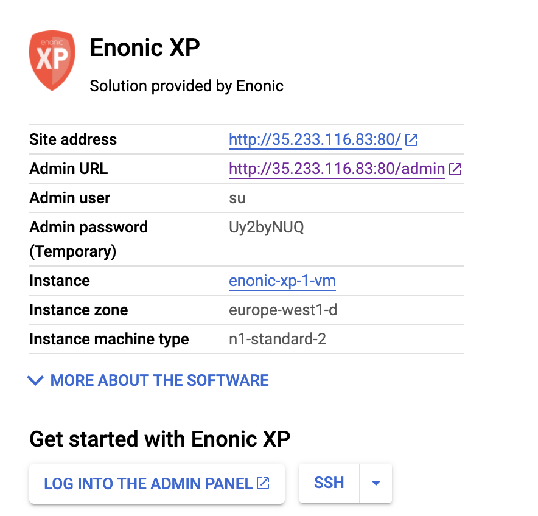

= Launching Enonic XP on the Google Cloud Platform
:toc: right
:experimental:

*This guide takes you through the basic steps of running Enonic XP on GCP*

****
[WARNING]
====
THIS DOCUMENT IS WORK IN PROGRESS
====
****

== Deploy Launcher image

[cols="1%s,99%a"]
[frame="none"]
[grid="none"]
|============================
|1| Visit https://cloud.google.com/ and select `Launcher` from the top menu.
|2| Click  btn:[Explore Launcher] and then search for Enonic XP.
|3| You should now see the image below, click btn:[Launch on Compute Engine]

|4| You should now see the image below:

image::images/launcher-deploy.png["Deploy Enonic XP"]

You may optionally change the settings above to match your requirements.

When ready, press btn:[Deploy].
|5| You will now see a new screen as the server is starting.

image::images/launcher-booting.png["Deploy Enonic XP"]

[WARNING]
====
The launch process typically takes 1 to 2 minutes, all depending on the server size.
After the Google Cloud loading icons stop spinning, the image might not be ready.
XP docker containers are built in the background - during this time you might see a 503 error so please have patience.
====
|============================

== Login and Welcome Tour

When you have confirmed the server is running, it is time to login to the Admin Console.

[cols="1%s,99%a"]
[frame="none"]
[grid="none"]
|============================
|1| Click btn:[Log into the Admin Panel] from the right panel to access Enonic XP Admin Console

|2| Sign in with username `su` and the temporary password listed in the right panel

|3| *Complete "Welcome Tour":* The first time you visit your installation, the Welcome Tour will be displayed.
Go through the steps, and optionally install the demo applications.

TIP: The welcome tour is only displayed for administrative users, and can be disabled using configuration options.

|============================

== Create the admin user

Using the "Super User" `su` to manage your instance is not recommended, also the temporary password will be reset every time you restart the instance.
As such we need to create an administrative user that can be used on a permanent basis

[cols="1%s,99%a"]
[frame="none"]
[grid="none"]
|============================
|1| *Open Users tool:* From the launcher panel on the right (optionally hidden behind the top right burger icon) click btn:[Users].
|2| *New User:* To create a new user simply click btn:[New] and then btn:[User] from the top menu.

image::images/xp-user-new.png["New User", width="600px"]
|3| *Set the user name:* This is a personal user - choose your favorite user name

image::images/xp-user-name.png["New User", width="500px"]

|4| *Set the password:* This user will have access to your entire system, make sure to use a secure password.

TIP: The password is hashed, and never stored as plain text in XP
|5| *Add roles:* Finish off by adding roles to the user: "Administrator" and "Admin Console Login".

When ready press btn:[Save]
|6| *Verify the user:* To make sure the user is working properly, log out from the bottom of the launcher menu, and test logging in again with your new user
|============================

== System Management

The launcher image includes the essential tools you need to run XP in production mode.
The server is configured and managed using Docker compose, which orchestrates the three embedded Docker images: Enonic XP, Apache and the postfix mail server

This setup gives you an excellent way to manage the configuration of your server without changing any of the software packages directly.

To access the server command line click the btn:[SSH] button from the right panel in the Google Cloud console.

TIP: You cannot run as root on GCP instances, so you may need to "sudo" your commands if permissions are denied

You should now get access to the command line prompt:

image::images/ubuntu-cli.png["Command line access"]

If you have not worked with Docker before, we recommend you to have a look at https://docs.docker.com/[Dockers excellent documentation].

Here is a list of common operations you may want to try out:

* List running containers

  sudo docker ps

* Show last 100 log lines from a container

  sudo docker logs --tail 100 <containerID>

If you need to change the configuration of a container you need to update the configuration files, remove, rebuild and start the changed containers.
For this purpose, we use docker-compose. Docker can manage all the containers on your server at once, and also takes care of exposing ports between the containers.

TIP: At first this might seem complicated compared to manipulating a container directly. However it enables you to safely apply, and even rollback changes to a container.

To use docker-compose, you need to change to the directory where your configuration files are stored.
Default location:

  cd /srv/docker-compose-enonic-xp/

Now, you may browse and optionally edit the configuration files of your server.

TIP: Consider using Git to store your configuration files, this enables you to safely manage and rollback any changes you have made to the configuration at any time

As an example, if you have changed the configuration of Apache and want to redeploy it:

  docker-compose rebuild apache2

  docker-compose up -d --no-deps apache2

== Virtual host configuration

When you are ready to start using the server for production purposes, the following steps will enable you to route a domain to your server and route it to a specific site or application within XP.

[cols="1%s,99%a"]
[frame="none"]
[grid="none"]
|============================
|1| *Reserve a permanent IP:* When your instance is first launched, it will be running with a so-called ephemeral IP. In order to reserve a static IP follow this documentation: https://cloud.google.com/compute/docs/ip-addresses/reserve-static-external-ip-address
|2| *Point your domain to the static IP:* Once you have an IP, point your domain to this IP through settings from your DNS provider
|3| *Disable default vhost:* Rename the file `0-default.conf` located in `srv/docker-compose-enonic-xp/apache2/sites/` to `0-default.conf.disabled`.
|4| *Add custom virtualhost to Apache:* We can now configure a our custom virtualhost in Apache.

Adding a specific apache virtualhost will enable us to control logging, redirects, rewrites and other traffic elements for a specific domain.

To setup a custom virtualhost copy and rename the file `sample.conf.template` to for instance `domain.com.conf`.
Edit the new file with your custom settings. It should look something like this:

[source,apache]
----
<VirtualHost *:80>

  ServerName domain.com
  ServerAlias www.domain.com

  DocumentRoot /var/www/html/

  ProxyRequests Off
  ProxyPreserveHost On

  ProxyPass / http://exp:8080/
  ProxyPassReverse / http://exp:8080/

  RewriteEngine on

  # Support web socket for this vhost
  RewriteCond %{HTTP:Upgrade} =websocket [NC]
  RewriteRule /(.*) ws://exp:8080/$1 [P,L]

  # Send traffic to domain without www
  RewriteCond %{HTTP_HOST} !^domain\.com$
  RewriteCond %{HTTP_HOST} !^$
  RewriteRule ^/(.*) http://domain.com/$1 [L,R]

</VirtualHost>
----

|5| *Configure XP vhost:* In the standard configuration, Apache will to proxy all incoming traffic to a single port in XP (8080).

XP vhosts are used to route traffic from a specific domain to a specific path in XP i.e. admin.domain.com -> /admin (Admin console), or domain.com -> /portal/master/mysite  (A specific site).
By default vhosts are disabled, allowing all incoming traffic to access all paths.

To configure a vhost, simply edit the file `com.enonic.xp.web.vhost.cfg` located in `/srv/docker-compose-enonic-xp/exp/config`.

A vhost configuration for "domain.com" might look like this:

[source,properties]
----
enabled = true

mapping.mysite.host = domain.com
mapping.mysite.source = /
mapping.mysite.target = /portal/master/mysite

mapping.admin.host = domain.com
mapping.admin.source = /admin
mapping.admin.target = /admin
mapping.admin.userStore = system
----

|4| *Deploy changes* In order to deploy the new configuration, run the following commands:

  docker-compose build apache2 exp

This command builds new containers with the updated configuration (old containers will still be running)

  docker-compose up -d --no-deps apache2 exp

This will stop the old image of Apache and Enonic XP, remove the containers, and deploy and start the new containers including the updated configuration.

NOTE: Enonic XP does not actually require a restart to load updated configuration files (with the exception of `system.properties`). However, this setup provides a nice and consistent way to manage your configuration.
You can customize XP to load configuration dynamically if desired.

|============================

== HTTPS configuration

The image ships with a self-signed SSL certificate, which cannot be used for production purposes.

NOTE: To complete this task you first need to configure a custom apache vhost as specified above.

[cols="1%s,99%a"]
[frame="none"]
[grid="none"]
|============================
|1| *Reserve a permanent IP:* Start by reserving a fixed IP from Google Cloud (TODO)
|2| *Add domain to Apache:* (TODO)
|3| *Configure vhost in XP:* Finally, since all traffic from apache is sent to a single port in XP, we need to configure the vhost file to route the domain to the proper path in XP. (TODO)
|============================

== Backup

First of all, We recommend storing the docker-compose configuration files in a Git repository. Any changes you make to you configuration will then be duplicated to your git repo.
This will effectively act as a backup for your configuration.

[cols="1%s,99%a"]
[frame="none"]
[grid="none"]
|============================
|1| *Install Snapshotter app* When installed, the Snapshotter app[https://market.enonic.com/vendors/enonic/snapshotter] will automatically snapshot your data on a regular frequency.
This will enable you to rollback to a snapshot quickly if needed.
|2| *Backup your files:* As long as snapshots are running, we only need to copy the the data files to your backup device.

As we are using Docker, the backup files are not directly accessible from your filesystem.
More specifically,
|============================

Additionally, Enonic XP also provides Dump (complete dump of all data) and Export (export of selected data) services for moving data out of the system.

== Upgrading

To upgrade to a new version of Enonic XP:

WARNING: Upgrading XP should always be tested in a QA environment before you apply it to your production server

[cols="1%s,99%a"]
[frame="none"]
[grid="none"]
|============================
|1| *Read Release notes* Start by carefully reading the upgrade notes from Enonic to make sure you follow any required steps to complete the upgrade.
|2| *Update Docker configuration:* As long as you are upgrading to a new feature of fix release, i.e. from XP 6.14.1 to 6.15.0 you should be able to upgrade simply by changing the first line of the file `/srv/docker-compose-enonic-xp/exp/Dockerfile`. This line specifies the XP docker container to use.
|============================

[quote, The Enonic Team]
Congratulations, you now have a production-ready single server instance of Enonic XP running on the Google Cloud platform!
